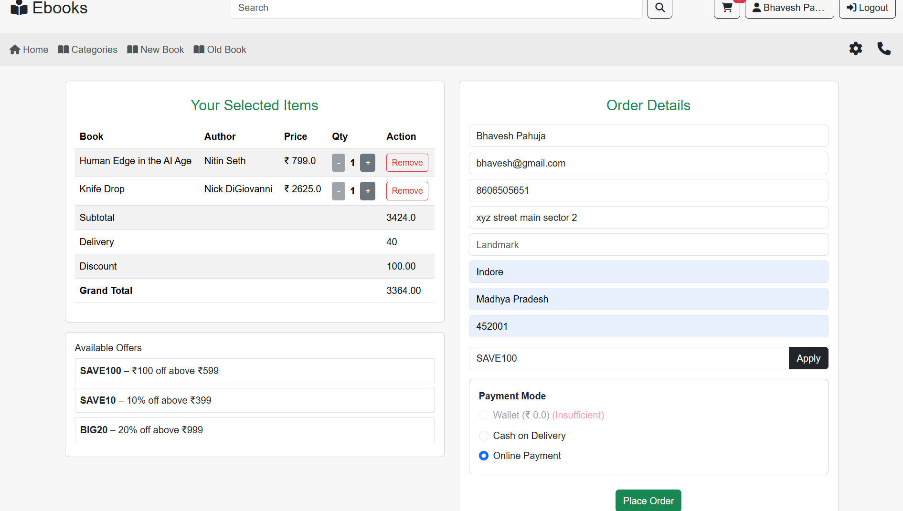
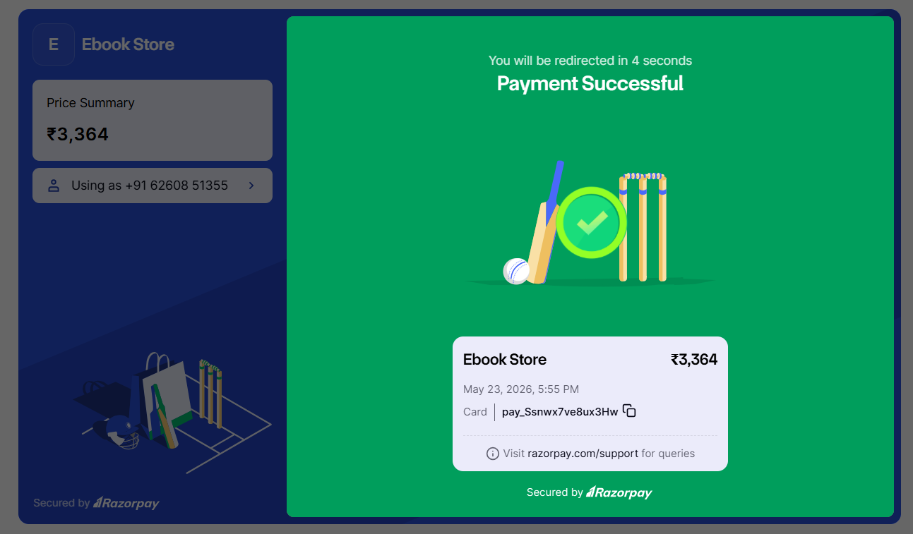
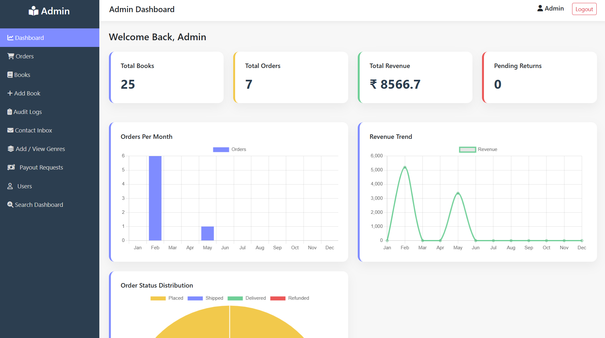

# 📚 EBOOK-APP

<p align="center">
  
  
  
  
  
  
  
</p>

---

# 🚀 Enterprise Multi-Vendor eCommerce Marketplace

EBOOK-APP is a full-scale enterprise-level eCommerce marketplace built using Java Servlet, JSP, JDBC, and MySQL following MVC architecture principles.

The platform supports:

- Multi-role authentication
- Seller marketplace system
- Razorpay payment integration
- Wallet infrastructure
- Recommendation engine
- AJAX-powered cart
- Admin analytics dashboard
- Review & rating system
- Security filters and audit logging

---

# 🏗️ System Architecture

```text
Client Browser
      ↓
JSP Pages (View Layer)
      ↓
Servlet Controllers
      ↓
Business Logic Layer
      ↓
DAO Layer
      ↓
MySQL Database
```

---

# 🛠️ Tech Stack

## Backend
- Java 17
- Servlet
- JSP
- JDBC
- JSTL

## Frontend
- HTML5
- CSS3
- Bootstrap
- JavaScript
- AJAX
- Chart.js

## Database
- MySQL

## Security
- BCrypt Password Hashing
- CSRF Protection
- IP Blocking
- Session Security
- Audit Logging

## Payment Integration
- Razorpay Payment Gateway

## Build Tool
- Maven

## Server
- Apache Tomcat

---

# ✨ Major Features

## 🔐 Authentication & Security
- OTP-based registration
- Forgot password system
- BCrypt password hashing
- Brute-force protection
- Session management
- CSRF protection
- Role-based access control

---

## 👥 Multi-Role System
### Admin
- Manage books
- Manage users
- Revenue analytics
- Order management
- Refund approvals

### Seller
- Upload books
- Wallet management
- Payout tracking
- Sales analytics

### Customer
- Browse/search books
- Add to cart
- Place orders
- Write reviews
- Use coupons

---

## 📚 Book Management
- Add/Edit/Delete books
- Multi-genre support
- Image uploads
- Dynamic filtering
- Stock management

---

## 🔍 Advanced Search Engine
- AJAX live suggestions
- Fuzzy search
- Typo tolerance
- Full-text search
- Autocomplete system

---

## 🛒 Cart & Checkout
- AJAX cart updates
- Quantity management
- Live subtotal calculation
- Coupon engine
- Razorpay checkout integration

---

## 💳 Payment System
- Razorpay integration
- HMAC SHA256 verification
- Secure payment validation
- Duplicate payment prevention

---

## 📦 Order Management
- Order lifecycle tracking
- Return & refund system
- Invoice generation
- Order history

---

## ⭐ Review System
- Ratings & reviews
- Helpful voting
- Average rating calculation
- Review pagination

---

## 📊 Admin Analytics Dashboard
- Revenue analytics
- Monthly charts
- Live statistics
- Business insights
- AJAX-powered dashboard

---

# 📂 Project Structure

```text
EBOOK-APP/
│
├── src/
│   ├── main/
│   │   ├── java/
│   │   │   ├── DAO/
│   │   │   ├── entity/
│   │   │   ├── servlet/
│   │   │   ├── filter/
│   │   │   └── util/
│   │   │
│   │   └── webapp/
│   │
├── pom.xml
├── .gitignore
└── README.md
```

---

# ⚡ Security Features

✔ BCrypt Password Hashing  
✔ CSRF Protection  
✔ Session Security  
✔ Role-Based Authorization  
✔ IP Threat Blocking  
✔ Audit Logging  
✔ OTP Verification  
✔ Secure Payment Validation  

---

# 📈 Advanced Functionalities

- Recommendation Engine
- Trending Algorithm
- Wallet Infrastructure
- Seller Payout System
- Coupon Engine
- AJAX Real-Time Updates
- Analytics Dashboard
- Invoice PDF Generation

---

# 📸 Application Preview

## 🏠 Homepage


---

## 🛒 Checkout & Coupon System


---

## 💳 Razorpay Payment Gateway


---

## ✅ Payment Success Verification


---

## 📊 Admin Analytics Dashboard



---

# ⚙️ Installation & Setup

## 1️⃣ Clone Repository

```bash
git clone https://github.com/bhaveshh07/EBOOK-APP.git
```

---

## 2️⃣ Open Project
Import the project into:
- Eclipse
- IntelliJ IDEA
- NetBeans

---

## 3️⃣ Configure Database

Create MySQL database:

```sql
CREATE DATABASE ebook_app;
```

Update database credentials inside:

```text
DBConnect.java
```

---

## 4️⃣ Build Project

```bash
mvn clean install
```

---

## 5️⃣ Deploy on Tomcat
- Copy WAR file to Tomcat webapps folder
OR
- Run directly from IDE server configuration

---

# 🚀 Future Enhancements

- Spring Boot Migration
- REST APIs
- React Frontend
- JWT Authentication
- Docker Deployment
- Elasticsearch Integration
- AI Recommendation System

---

# 🤝 Collaborator

## Tanisha Soni
### Backend Development & Architectural Support

Contributed to:
- Backend architecture planning
- System structure optimization
- Feature workflow discussions
- Enterprise architecture support
- Project development assistance

---

# 👨‍💻 Author

## Bhavesh Pahuja

GitHub:
https://github.com/bhaveshh07

---

# ⭐ Show Your Support

If you like this project, give it a ⭐ on GitHub!
